<div align="center">

# 🏫 Smart Campus AI

### AI-Powered Intelligent University Management System

<p align="center">
Faculty of Computers and Artificial Intelligence<br>
Menoufia National University
</p>

---


---

### 🚀 Graduation Project 2026

An AI-powered Smart Campus platform that integrates

**Flutter • Supabase • FastAPI • Gemini AI • Hybrid RAG**

to build a complete digital university ecosystem.

---

</div>

# 📑 Table of Contents

- Overview
- Problem Statement
- Proposed Solution
- Key Features
- System Architecture
- Technology Stack
- AI Chatbots
- Hybrid RAG Pipeline
- Anti-Fraud Attendance
- Database Design
- Folder Structure
- Installation
- Screenshots
- Performance
- Future Work
- Team

---

# 🌍 Overview

Smart Campus AI is an integrated university management platform developed as a graduation project for the Faculty of Computers and Artificial Intelligence, Menoufia National University.

The platform combines Artificial Intelligence, Mobile Computing, Cloud Computing, and Modern Software Engineering practices to digitize the university experience.

Instead of using many disconnected systems, Smart Campus AI provides one intelligent application for every university member.

The system includes:

- 🎓 Student Portal
- 👨‍🏫 Professor Portal
- 🏢 Administration Portal
- 🤖 AI Academic Advisor
- 📚 University Regulations Chatbot
- 📍 Smart Campus Navigation
- 📅 Smart Scheduling
- 📊 Analytics Dashboard
- 🔐 Secure Attendance

---

# 🎯 Problem Statement

Universities still suffer from many traditional problems, including:

- Attendance fraud
- Paper-based regulations
- Disconnected systems
- Communication difficulties
- Manual scheduling
- Lack of intelligent student support

These issues waste time, reduce productivity, and negatively affect the educational experience.

---

# 💡 Proposed Solution

Smart Campus AI solves these problems through a unified intelligent platform powered by Artificial Intelligence.

The platform combines:

- Flutter Mobile Application
- Supabase Cloud Backend
- PostgreSQL Database
- FastAPI Microservices
- Google Gemini AI
- Hybrid RAG Search
- Google Maps Platform
- Firebase Cloud Messaging

into one seamless ecosystem.

---

# ⭐ Main Features

## 🎓 Student

- QR Attendance
- View Schedule
- AI Study Advisor
- Regulations Chatbot
- GPA Tracking
- Campus Navigation
- Assignments
- Exams
- Real-time Chat
- Notifications

---

## 👨‍🏫 Professor

- Attendance Management
- Dynamic QR Generation
- Material Upload
- Assignment Management
- Exam Management
- Attendance Reports
- Student Analytics

---

## 🏢 Admin

- Classroom Management
- Subject Management
- Timetable Management
- Reports
- Buildings Management

---

## 👑 Administrator

- User Management
- Colleges Management
- Global Scheduling
- Notifications
- Dashboard Analytics

---

# 🚀 Why Smart Campus AI?

Unlike traditional university management systems, Smart Campus AI combines:

- Artificial Intelligence
- Mobile Computing
- Cloud Computing
- Secure Attendance
- Hybrid Information Retrieval
- Intelligent Academic Assistance

inside one modern application designed specifically for higher education.

---

# 🏗️ System Architecture

Smart Campus AI follows a scalable multi-tier architecture based on **Clean Architecture** principles.

The system is divided into four main layers:

- 📱 Presentation Layer (Flutter)
- ⚙️ Business Logic Layer (BLoC/Cubit)
- ☁️ Backend Layer (Supabase + FastAPI)
- 🤖 AI Layer (Hybrid RAG + Gemini)

---

## High-Level Architecture

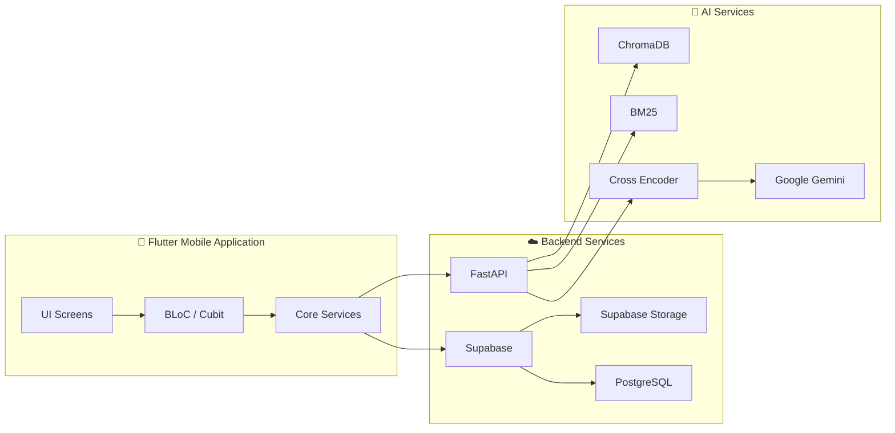

---

# 🧩 Clean Architecture

The Flutter application follows **Clean Architecture** to ensure scalability and maintainability.

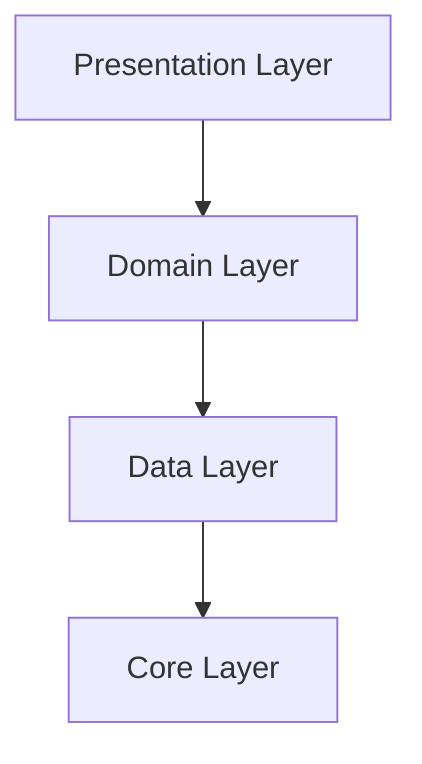

---

## 📱 Presentation Layer

Responsible for:

- UI
- Navigation
- Screens
- State Management

Technologies

- Flutter
- Bloc
- Cubit

---

## 🧠 Domain Layer

Responsible for

- Business Rules

Contains

- Entities
- Use Cases
- Repository Interfaces

---

## 💾 Data Layer

Responsible for

- API Calls
- Local Storage
- Repository Implementation

---

## ⚙️ Core Layer

Contains

- Dependency Injection
- Constants
- Themes
- Network Services
- Utilities

---

# 📂 Flutter Project Structure

```text
lib
│
├── core
│   ├── constants
│   ├── services
│   ├── themes
│   ├── widgets
│   ├── helpers
│   └── utils
│
├── features
│   ├── auth
│   ├── student
│   ├── doctor
│   ├── admin
│   ├── administrator
│   ├── chatbot
│   ├── attendance
│   ├── schedule
│   ├── navigation
│   ├── exams
│   └── chat
│
├── models
├── repositories
├── blocs
├── routes
├── main.dart
```

---

# ⚙️ Backend Architecture

The backend consists of two independent services.

## Supabase

Responsible for

- Authentication
- Database
- Realtime
- Storage
- Row Level Security

---

## FastAPI

Responsible for

- AI Chatbot
- Hybrid Search
- Embedding
- PDF Processing
- Question Answering

---

# ☁️ Backend Workflow

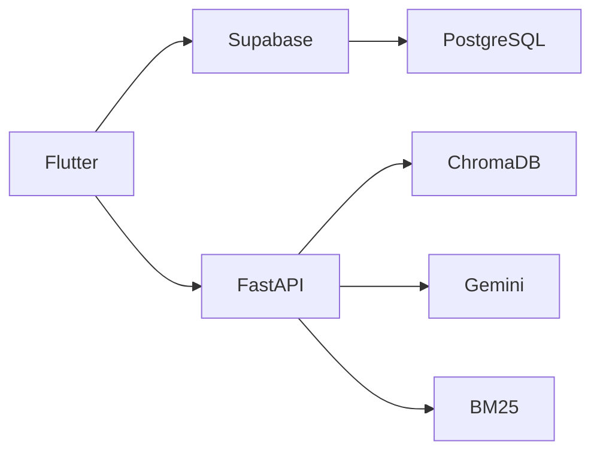

---

# 🔄 Request Flow

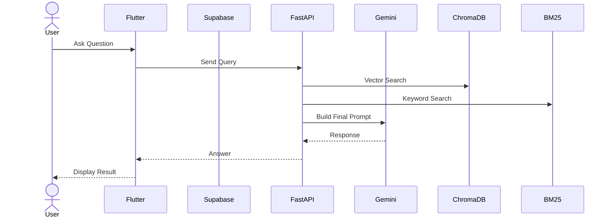

---

# 🔐 Authentication Flow

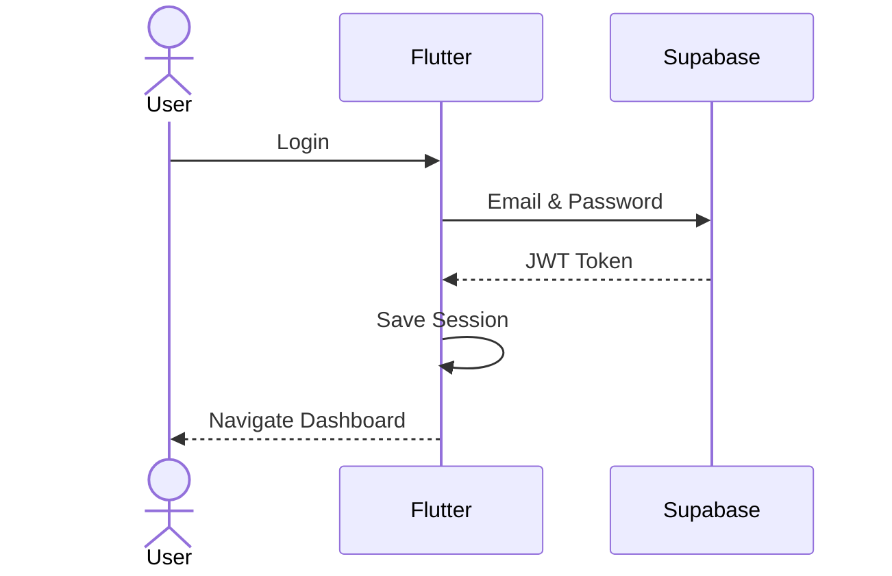

---

# 🔥 Technology Stack

| Layer | Technologies |
|--------|--------------|
| Mobile | Flutter |
| Language | Dart |
| Backend | FastAPI |
| Cloud | Supabase |
| Database | PostgreSQL |
| Authentication | GoTrue JWT |
| Storage | Supabase Storage |
| AI | Google Gemini |
| Vector Database | ChromaDB |
| Search Engine | BM25 |
| State Management | Bloc |
| Maps | Google Maps |
| Notifications | Firebase Cloud Messaging |

---

# 🤖 Artificial Intelligence Module

Artificial Intelligence is one of the core components of Smart Campus AI.

Instead of providing a traditional chatbot, the platform delivers two intelligent assistants designed for different academic purposes.

---

# AI Components

| Module | Purpose |
|---------|----------|
| 🎓 Study Advisor | Academic assistance powered by Google Gemini |
| 📚 Regulations Chatbot | Hybrid RAG Question Answering |
| 🧭 Smart Navigation | Campus guidance |
| 📈 Recommendation Engine | Personalized recommendations |
| 🔍 Semantic Search | Intelligent document retrieval |

---

# 🎓 AI Study Advisor

The AI Study Advisor assists students throughout their academic journey.

### Features

- Personalized study plans
- GPA improvement suggestions
- Time management
- Learning roadmap
- Course recommendations
- Programming help
- Academic guidance
- Motivation & productivity tips

---

## Study Advisor Workflow

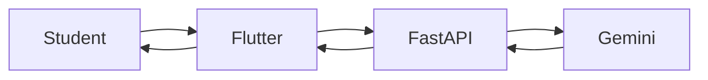

---

# 📚 University Regulations Chatbot

Instead of reading hundreds of pages of university regulations,

students simply ask questions in Arabic or English.

Example:

> How many credit hours are required for graduation?

or

> ما هي شروط التحويل؟

The chatbot retrieves the relevant regulation and generates an accurate answer.

---

# Why RAG?

Traditional LLMs may generate hallucinated answers.

Retrieval-Augmented Generation (RAG) solves this problem by retrieving information from official university documents before generating the response.

Benefits:

- Accurate
- Reliable
- Source-grounded
- Up-to-date
- Explainable

---

# 🧠 Hybrid RAG Pipeline

The project uses Hybrid Retrieval combining

- Dense Search
- Sparse Search

This achieves higher recall and higher precision than using either technique alone.

---

## RAG Architecture

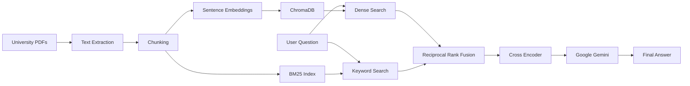

---

# Document Processing Pipeline

The ingestion pipeline consists of multiple stages.

1. Read PDF
2. Clean Text
3. Normalize Arabic
4. Split into Chunks
5. Generate Embeddings
6. Store in ChromaDB
7. Create BM25 Index

---

## PDF Processing

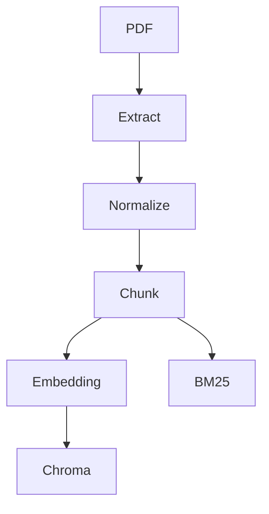

---

# Retrieval Pipeline

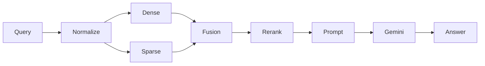

---

# Embedding Model

The project uses

**all-MiniLM-L6-v2**

Advantages

- Fast
- Lightweight
- 384-dimensional vectors
- Excellent semantic similarity

---

# Vector Database

The project uses

## ChromaDB

Responsibilities

- Store embeddings

- Similarity Search

- Metadata Storage

- Fast Retrieval

---

# Sparse Retrieval

The project also uses

## BM25

Responsibilities

- Keyword Search

- Exact Match

- Article Numbers

- Regulation Codes

---

# Hybrid Search

Instead of choosing one retrieval algorithm,

the project combines both.

Advantages

✔ Better Recall

✔ Better Precision

✔ Better Ranking

✔ Better User Experience

---

# Cross Encoder Reranking

After retrieval,

the candidate chunks are reranked using a Cross Encoder.

Benefits

- Removes irrelevant chunks

- Improves context quality

- Increases answer accuracy

---

# Google Gemini

Gemini is responsible for

- Understanding the question

- Reading retrieved context

- Generating the final answer

- Avoiding hallucinations

---

# AI Workflow

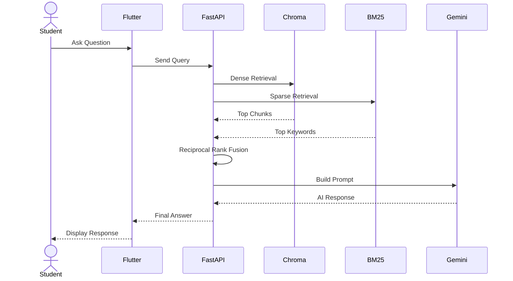

---

# AI Advantages

✅ Hybrid Retrieval

✅ Source Grounding

✅ Hallucination Reduction

✅ Arabic Language Support

✅ English Language Support

✅ Fast Response

✅ High Accuracy

✅ Semantic Understanding

✅ Citation-Based Answers

---

````md
# 🔐 Smart Attendance Security System

One of the most innovative modules in Smart Campus AI is the Anti-Fraud Attendance System.

Unlike traditional attendance systems that rely only on QR codes, Smart Campus AI validates multiple security layers before accepting any attendance request.

---

# 🎯 Objectives

The attendance system was designed to eliminate:

- QR Screenshot Sharing
- Proxy Attendance
- Fake GPS Locations
- Multi-Account Attendance
- Replay Attacks
- Expired QR Usage

---

# 🛡️ Multi-Layer Security

Every attendance request passes through multiple validation layers.

| Security Layer | Purpose |
|---------------|---------|
| Dynamic QR | Prevent screenshot sharing |
| Token Expiration | Prevent replay attacks |
| Wi-Fi Validation | Ensure student is inside campus |
| GPS Validation | Verify physical location |
| Device Fingerprint | Prevent multi-account attendance |
| JWT Authentication | Verify user identity |
| Database Validation | Prevent duplicate scans |

---

# 🔄 Attendance Workflow

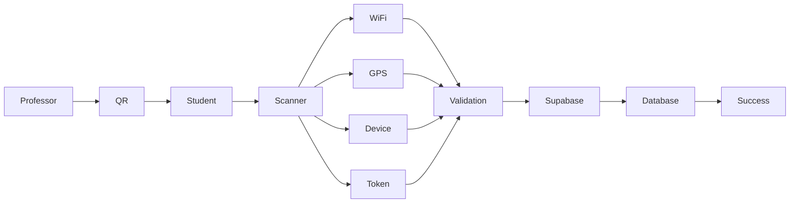

---

# 📱 QR Generation

Each lecture generates a unique encrypted QR code.

The QR contains:

- Session ID
- Subject ID
- Professor ID
- Timestamp
- Random Token
- Expiration Time

The QR automatically changes every **5 minutes**.

---

# 🔄 QR Lifecycle

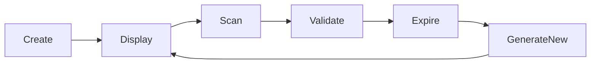

---

# 📍 GPS Verification

Before sending attendance,

the application verifies

- Latitude
- Longitude
- Campus Radius

If the student is outside the allowed area,

attendance is rejected immediately.

---

# 📶 Wi-Fi Validation

The application checks

- Connected SSID
- BSSID
- Internet Availability

Only the official university Wi-Fi is accepted.

Example

Accepted

MNU_WIFI

Rejected

Home WiFi

Hotspot

Coffee Shop

---

# 📱 Device Fingerprinting

Every device receives a unique identifier.

Examples

Android ID

Device Model

Operating System

Device UUID

The system stores one registered fingerprint for every student.

If another account attempts attendance using the same device,

the request is rejected.

---

# 🔐 Authentication

The attendance request also requires

- Valid JWT
- Active User
- Student Role
- Valid Session

---

# Attendance Sequence

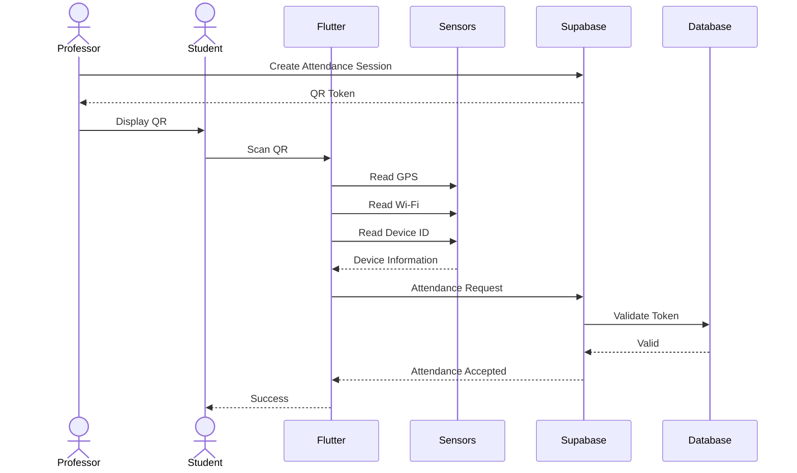

---

# 🔍 Database Validation

The backend verifies

- Student Exists

- Session Exists

- Token Exists

- Token Not Expired

- Device Matches

- Wi-Fi Matches

- GPS Valid

- User Role

- Duplicate Scan

If any validation fails,

attendance is rejected.

---

# Validation Flow

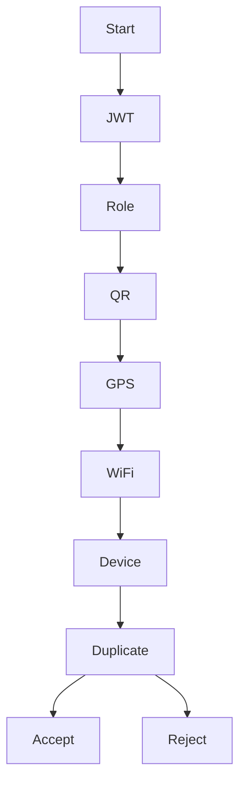

---

# 🚫 Fraud Prevention

The system successfully prevents

✅ Screenshot Sharing

✅ QR Replay

✅ Fake GPS

✅ Device Sharing

✅ Multi-Account Attendance

✅ Expired QR Usage

---

# Security Advantages

- Dynamic QR Rotation

- Device Fingerprinting

- JWT Authentication

- Wi-Fi Verification

- GPS Validation

- Database Constraints

- Real-Time Validation

- Secure Attendance Logs

---

# Attendance Technologies

| Component | Technology |
|-----------|------------|
| Mobile | Flutter |
| Authentication | Supabase Auth |
| Database | PostgreSQL |
| Security | JWT |
| QR | qr_flutter |
| GPS | geolocator |
| Wi-Fi | network_info_plus |
| Device ID | device_info_plus |
| Backend | FastAPI |
| Cloud | Supabase |

---

# Performance

Average QR Validation Time

**< 1 second**

Attendance Accuracy

**100%**

Duplicate Prevention

**100%**

Token Replay Protection

**100%**

QR Expiration

**5 Minutes**

---
````

````md
# 🗄️ Database Design

Smart Campus AI uses **Supabase PostgreSQL** as the primary relational database.

The database is designed using normalization principles and supports real-time synchronization, Row-Level Security (RLS), and scalable relationships.

---

# Database Overview

The system manages:

- Authentication
- Colleges
- Buildings
- Rooms
- Users
- Subjects
- Attendance
- Exams
- Assignments
- Materials
- Chat
- Notifications

---

# Entity Relationship Diagram (ERD)

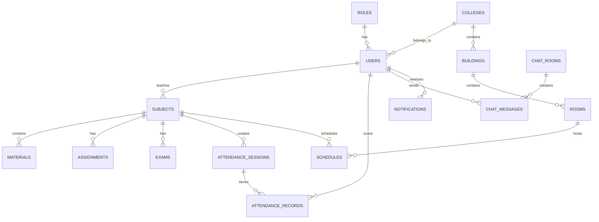

---

# Core Tables

| Table | Description |
|--------|-------------|
| users | Stores all users |
| roles | RBAC roles |
| colleges | University colleges |
| buildings | Campus buildings |
| rooms | Lecture halls |
| subjects | Academic courses |
| schedules | Lecture timetable |
| attendance_sessions | QR sessions |
| attendance_records | Student attendance |
| exams | Online exams |
| assignments | Assignments |
| materials | Learning resources |
| chat_rooms | Chat channels |
| chat_messages | Messages |
| notifications | Push notifications |

---

# Database Architecture

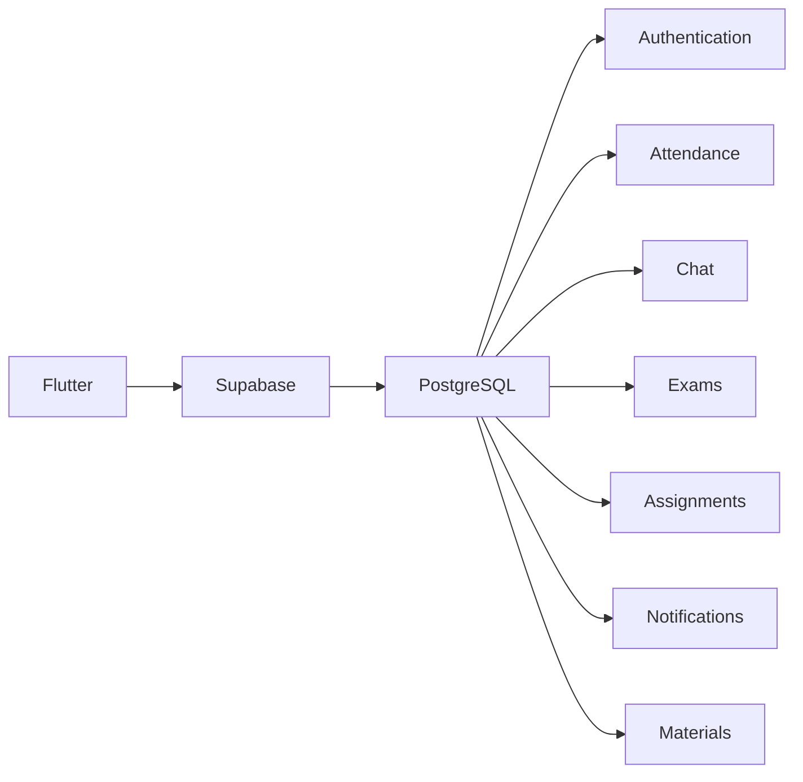

---

# Authentication Module

Responsible for

- Login
- Registration
- Password Reset
- JWT Authentication
- Session Management

---

# Attendance Module

Stores

- QR Session
- Device ID
- GPS
- Wi-Fi
- Scan Time

---

# Academic Module

Responsible for

- Subjects

- Materials

- Assignments

- Exams

- GPA

---

# Chat Module

Supports

- Private Chat

- Group Chat

- Subject Chat

- Attachments

- Images

- PDF Files

---

# Notification Module

Supports

- Push Notifications

- Announcements

- Exam Alerts

- Assignment Reminders

- Attendance Alerts

---

# Database Security

The database uses

- Row Level Security

- JWT Authentication

- Foreign Keys

- Constraints

- Indexes

- Transactions

---

# Row Level Security

Examples

Student

Can access only

- Personal Attendance

- Personal GPA

- Own Assignments

Professor

Can access

- Course Students

- Attendance Reports

- Uploaded Materials

Administrator

Can access

Everything

---

# Database Relationships

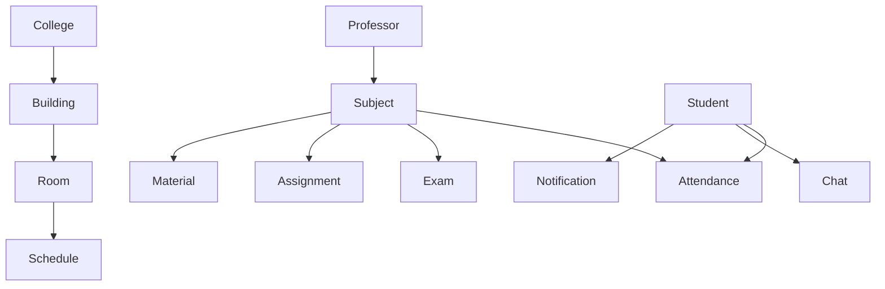

---

# Folder Structure

The project follows a modular architecture.

```text

Smart-Campus-AI

│

├── Smart-Canvas001

│ ├── android

│ ├── ios

│ ├── linux

│ ├── windows

│ ├── web

│ ├── macos

│ ├── assets

│ ├── lib

│ │

│ ├── core

│ ├── features

│ ├── models

│ ├── repositories

│ ├── services

│ ├── widgets

│ ├── routes

│ └── main.dart

│

├── Rag Update

│

├── api

├── models

├── chroma_db

├── documents

├── scripts

├── requirements.txt

├── main.py

│

├── docs

├── screenshots

├── README.md

└── LICENSE

```

---

# REST API Architecture

The mobile application communicates with FastAPI using REST APIs.

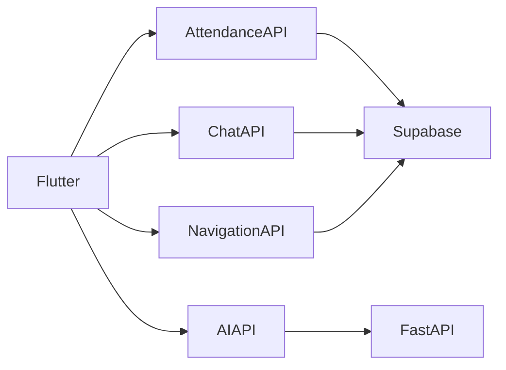

---

# Main API Endpoints

| Endpoint | Description |
|----------|-------------|
| POST /login | User Login |
| POST /register | User Registration |
| GET /subjects | Subjects |
| GET /schedule | Timetable |
| POST /attendance | Attendance |
| POST /chat | Send Message |
| GET /notifications | Notifications |
| POST /rag | Regulations Chatbot |
| POST /advisor | AI Study Advisor |

---

# Realtime Communication

The application uses

Supabase Realtime

Features

- Live Chat

- Attendance Updates

- Notifications

- Dashboard Refresh

---

# Storage

Files are stored in

Supabase Storage

Supported Types

- PDF

- Images

- Videos

- Documents

- Assignments

---

# Scalability

The architecture supports

- Thousands of Students

- Multiple Colleges

- Multiple Campuses

- Cloud Deployment

- Horizontal Scaling

---

# Advantages

✅ Modular Design

✅ Clean Architecture

✅ PostgreSQL

✅ Realtime

✅ Secure

✅ Scalable

✅ High Performance

---
````
````md
# ⚙️ Installation & Configuration

This section explains how to set up the Smart Campus AI project from scratch.

---

# 📋 Prerequisites

Before running the project, install the following tools:

| Software | Version |
|----------|---------|
| Flutter | 3.x or later |
| Dart SDK | Latest |
| Python | 3.10+ |
| Git | Latest |
| Android Studio | Latest |
| VS Code | Recommended |
| Supabase Account | Required |
| Google Gemini API Key | Required |

---

# 📥 Clone Repository

```bash
git clone https://github.com/MohammedMajidMohammed/Smart-Campus-AI-GradutionProject2026.git

cd Smart-Campus-AI-GradutionProject2026
```

---

# 📱 Flutter Setup

Navigate to the Flutter project.

```bash
cd Smart-Canvas001
```

Install packages.

```bash
flutter pub get
```

Check Flutter installation.

```bash
flutter doctor
```

---

# 🔐 Environment Variables

Create a file named

```
.env
```

Example

```env
SUPABASE_URL=https://xxxxxxxx.supabase.co

SUPABASE_ANON_KEY=xxxxxxxxxxxxxxxx

GOOGLE_MAPS_API_KEY=xxxxxxxxxxxxxxxx

GEMINI_API_KEY=xxxxxxxxxxxxxxxx
```

---

# ☁️ Supabase Configuration

Create a new Supabase project.

Enable

- Authentication
- Storage
- Realtime

Import SQL schema.

Configure

- RLS Policies
- Storage Buckets
- Authentication

---

# 🤖 AI Backend Setup

Move to backend folder.

```bash
cd "../Rag Update"
```

Create virtual environment.

Windows

```bash
python -m venv venv

venv\Scripts\activate
```

Linux / macOS

```bash
python3 -m venv venv

source venv/bin/activate
```

---

# 📦 Install Python Packages

```bash
pip install -r requirements.txt
```

---

# Backend Environment

Create

```
.env
```

Example

```env
OPENROUTER_API_KEY=xxxxxxxx

GEMINI_API_KEY=xxxxxxxx

SUPABASE_URL=https://xxxxxxxx.supabase.co

SUPABASE_SERVICE_ROLE_KEY=xxxxxxxx
```

---

# 🚀 Start Backend

```bash
python main.py
```

or

```bash
uvicorn main:app --reload
```

Backend URL

```
http://127.0.0.1:8000
```

---

# 📱 Run Flutter

Open another terminal.

```bash
cd Smart-Canvas001

flutter run
```

---

# 🏗 Build Release

Android APK

```bash
flutter build apk --release
```

Android App Bundle

```bash
flutter build appbundle --release
```

Windows

```bash
flutter build windows
```

Web

```bash
flutter build web
```

---

# 🌐 Deployment

The project can be deployed using

- Supabase Cloud
- Render
- Railway
- VPS
- Docker

---

# ☁️ Deployment Architecture

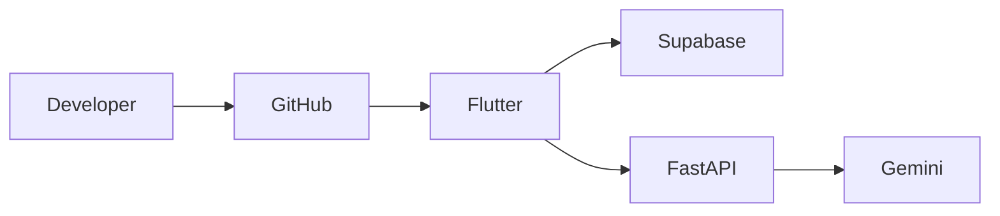

---

# 📱 Application Screens

The application contains more than 40 screens.

Main modules include

- Login

- Registration

- Home

- Schedule

- Attendance

- QR Generator

- QR Scanner

- AI Study Advisor

- Regulations Chatbot

- Chat

- Assignments

- Exams

- Navigation

- Notifications

- Settings

---

# 📸 Screenshots

Create a folder

```
screenshots/
```

Recommended images

```
screenshots/

01_login.png

02_dashboard.png

03_schedule.png

04_qr_generator.png

05_qr_scanner.png

06_ai_chatbot.png

07_rag_chatbot.png

08_assignments.png

09_exams.png

10_navigation.png

11_notifications.png

12_chat.png

13_profile.png
```

---

# 📊 Project Statistics

| Category | Value |
|-----------|--------|
| Flutter Screens | 40+ |
| Features | 30+ |
| Database Tables | 18+ |
| APIs | 25+ |
| AI Models | 3 |
| User Roles | 4 |
| Security Layers | 6 |
| Technologies | 15+ |

---

# 🚀 Performance

| Metric | Result |
|---------|--------|
| Startup Time | <2 sec |
| QR Validation | <1 sec |
| AI Response | 1–3 sec |
| Database Query | <100 ms |
| Chat Delay | <200 ms |

---

# 🔮 Future Work

Future enhancements include

- Indoor Navigation using BLE

- Face Recognition Attendance

- AI Voice Assistant

- Smart Timetable Generator

- Predictive Analytics

- Student Performance Prediction

- OCR for Student Documents

- AI Exam Generator

- AI Question Bank

- Multi-University Support

---

# 👨‍💻 Development Team

**Graduation Project 2026**

Faculty of Computers and Artificial Intelligence

Menoufia National University

### Team Members

- Mohammed Majid Mekhemer

- Mustafa Ayman Eldesoqy

- Rahma Hany Gaber

- Shahd Mostafa Khalil

- Nada Hany Mohamed

---

### Supervisor

Dr. Heba Emara

---

# ❤️ Acknowledgment

We sincerely thank our supervisor, faculty members, and everyone who contributed to this project.

Their guidance and continuous support played a significant role in the successful completion of Smart Campus AI.

---

# 📄 License

This repository is intended for academic purposes.

Copyright © 2026

Faculty of Computers and Artificial Intelligence

Menoufia National University

---

<div align="center">

# ⭐ Smart Campus AI

### Transforming Higher Education with Artificial Intelligence

Made with ❤️ by Smart Campus AI Team

2026

</div>
````
