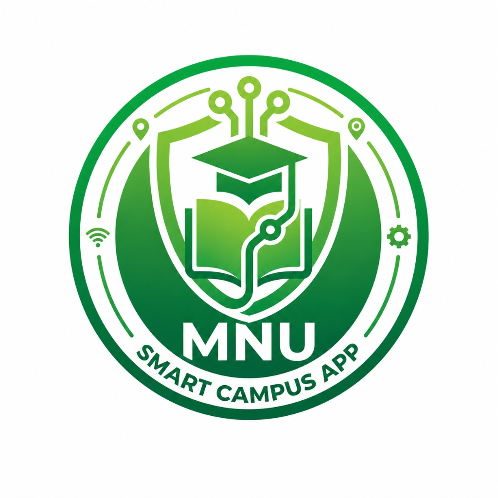
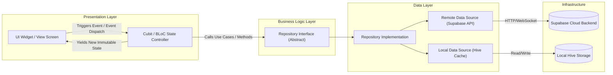
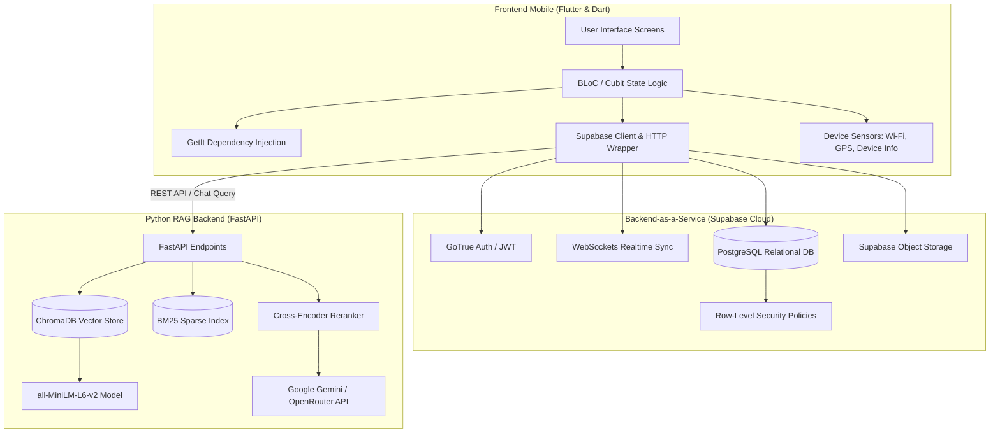
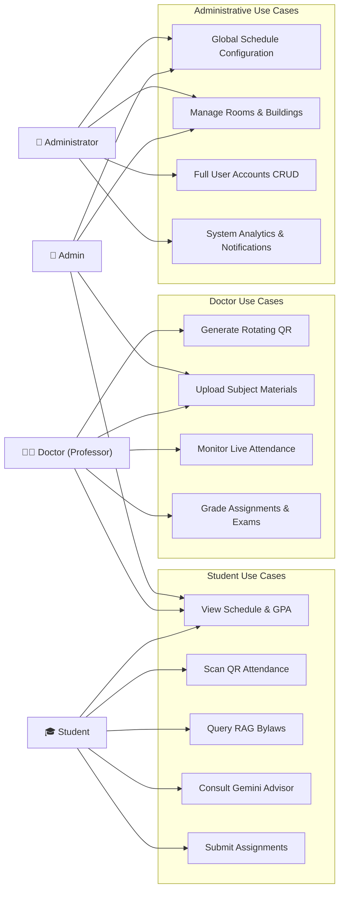
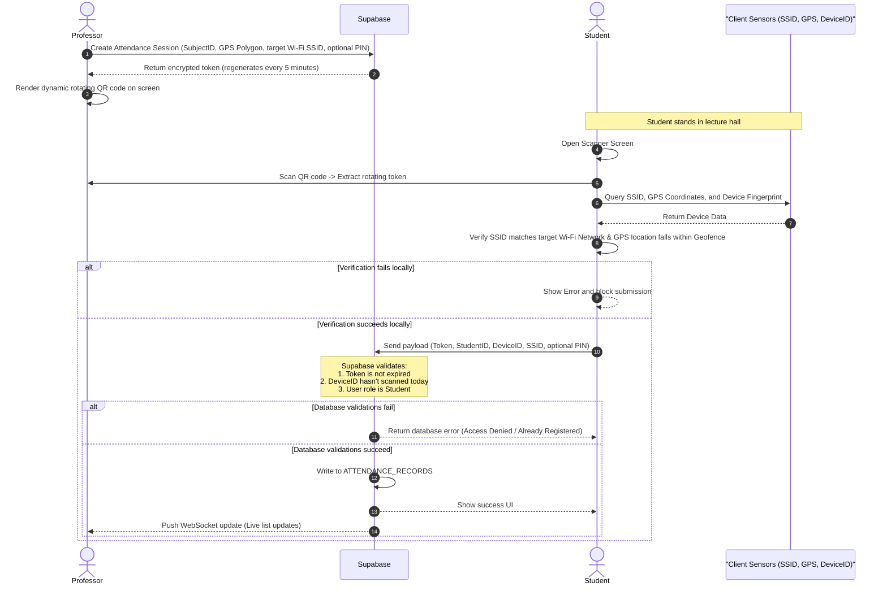
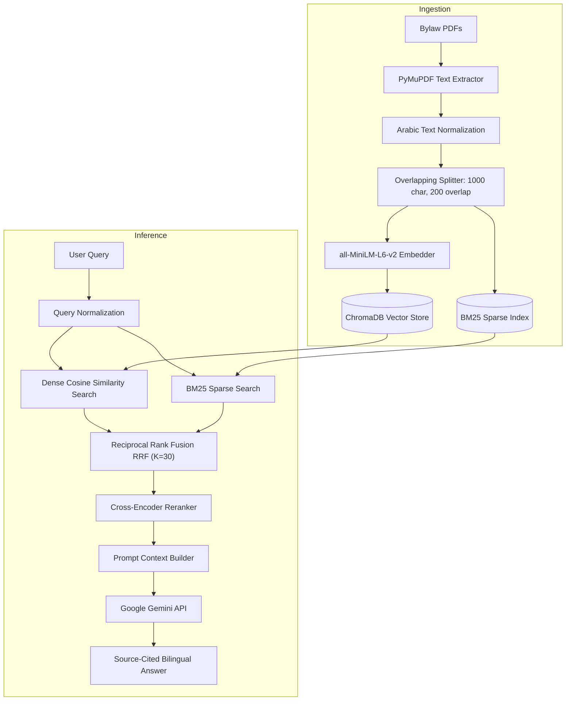
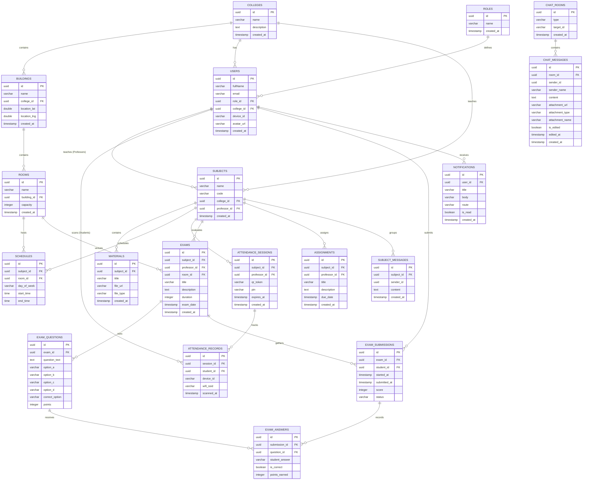

<div align="center">



# Smart Campus AI (MNU Smart Campus)
### An AI-Powered Intelligent University Management System for Menoufia National University (MNU)

</div>

---

[](https://flutter.dev)
[](https://dart.dev)
[](https://supabase.com)
[](https://fastapi.tiangolo.com)
[](https://deepmind.google/technologies/gemini/)

Smart Campus AI (MNU Smart Canvas) is a next-generation, integrated university management platform designed to address administrative fragmentation, proxy attendance fraud, and the difficulty of accessing university bylaws. By combining a cross-platform **Flutter** application, a robust **Supabase** cloud backend, and a custom **Python FastAPI RAG (Retrieval-Augmented Generation)** pipeline, the platform delivers a comprehensive digital experience tailored for **Students**, **Professors (Doctors)**, **Admins**, and **Administrators**.

---

## 📋 Table of Contents
1. [🌟 System Overview](#-system-overview)
2. [🏛️ Architectural Layer Model & Tech Stack](#️-architectural-layer-model--tech-stack)
3. [🚀 Key Features](#-key-features)
4. [👥 Role-Based System (RBAC) & Use Cases](#-role-based-system-rbac--use-cases)
5. [🔐 Anti-Fraud Attendance Handshake Protocol](#-anti-fraud-attendance-handshake-protocol)
6. [🤖 AI Chatbots & Hybrid RAG Pipeline](#-ai-chatbots--hybrid-rag-pipeline)
7. [🗄️ Database Design & ERD](#️-database-design--erd)
8. [📊 Database Schema & Data Dictionary](#-database-schema--data-dictionary)
9. [🛡️ Security Architecture & Row-Level Security (RLS)](#%EF%B8%8F-security-architecture--row-level-security-rls)
10. [⚠️ Implementation Challenges & Solutions](#%EF%B8%8F-implementation-challenges--solutions)
11. [📈 Evaluation & Performance Metrics](#-evaluation--performance-metrics)
12. [📱 User Interface & Screen Gallery](#-user-interface--screen-gallery)
13. [⚙️ Installation & Configuration](#%EF%B8%8F-installation--configuration)
14. [🔮 Future Work](#-future-work)

---

## 🌟 System Overview

Smart Campus AI was developed to overcome three primary issues in higher education management:
1. **Proxy Attendance Fraud**: Traditional attendance tracking (paper logs, static QR codes) is heavily vulnerable to remote scans, photo sharing, and GPS spoofing. This platform implements a secure, multi-sensor verification handshake.
2. **Access to Regulations**: University bylaws are lengthy, complex documents. Smart Campus AI deploys a custom Arabic-language-focused hybrid RAG model that allows students to query university policies and receive precise, source-grounded responses.
3. **Administrative Fragmentation**: Unifies schedules, material distribution, assignments, messaging, exams, grading, and campus navigation into a single application.

---

## 🏛️ Architectural Layer Model & Tech Stack

### System Components
The platform follows **Clean Architecture** principles across a split mobile-client and backend-microservice layout:
* **Frontend Mobile Client**: Built with Flutter and Dart, organized in modular feature directories (e.g., auth, student/attendance, chatbot, chat). State management uses the **BLoC / Cubit** pattern with immutable states and unidirectional data flow. Dependency injection is managed via **GetIt**.
* **Database & BaaS**: Supabase provides PostgreSQL storage, JWT-based **GoTrue** authentication, real-time WebSocket syncing (for attendance and chat), and object storage for course materials. Row-Level Security (RLS) is applied to all database tables.
* **RAG Backend Service**: A Python FastAPI microservice that extracts, cleans, chunks, embeds, and index regulations. It performs hybrid search and connects to Google Gemini / OpenRouter API to compile source-cited answers.

### Clean Architecture Data Flow


### High-Level System Architecture


---

## 🚀 Key Features

* **Anti-Fraud Attendance Verification**:
  * **Rotating QR Codes**: Tokens regenerate every **5 minutes** (screenshot sharing prevention).
  * **Wi-Fi SSID Check**: Ensures the student is connected to the registered campus network.
  * **GPS Geofencing**: Confirms student coordinates are within the campus boundary.
  * **Device Fingerprinting**: Links scans to unique device IDs to prevent multi-account scanning on one phone.
  * **Optional PIN Verification**: A manual 4-digit PIN generated by the doctor.
  * **Live Synchronization**: Real-time websocket pushes to the professor's dashboard.
* **AI-Powered Chatbot Hub**:
  * **Gemini Study Advisor**: Personalized academic guidelines, study plans, schedules, and concept reviews.
  * **Regulations RAG Bot**: Precise, bilingual questions answered with references from official university bylaws.
* **Campus Navigation**: Interactive Google Maps integration with Text-to-Speech (TTS) audio directions to university buildings and classrooms.
* **Schedule Editor**: Drag-and-drop global scheduling for administrators with conflict detection.
* **Academic Material Repository**: Subject-specific material upload/download, messaging channels, assignment submissions, exams countdown, and GPA tracker.

---

## 👥 Role-Based System (RBAC) & Use Cases

Access control is enforced at the database layer using PostgreSQL Row-Level Security (RLS). The system defines four distinct user roles:

```
Roles in System
├── Student       → View Schedule, Scan QR, Join Online Session, Chatbots, Chat, Navigate Campus
├── Doctor        → Create Schedule, Generate QR, Upload Material, Add Exams & Assignments, View Reports
├── Admin         → Manage Classrooms, Assign Subjects, Manage Local Schedules, View Analytics
└── Administrator → Full User CRUD, Manage Buildings/Colleges, Send Push Notifications, Global Config
```

### Use Case Diagram


---

## 🔐 Anti-Fraud Attendance Handshake Protocol

To prevent students from sharing attendance QR codes remotely, registering for absent peers, or spoofing GPS locations, the app initiates a secure, multi-layered handshake protocol:



---

## 🤖 AI Chatbots & Hybrid RAG Pipeline

The RAG Regulations Chatbot uses a dual-engine (dense + sparse) pipeline to ensure high recall for exact keywords (e.g. article numbers) and high precision for semantic queries:

### Ingestion Pipeline
1. **Extraction**: `PyMuPDF` reads the university regulation document PDFs.
2. **Text Normalization**: Custom cleaners remove Arabic diacritics (tashkeel), normalize character variants (e.g., matching shapes of Alef, Yeh, Teh Marbuta), and normalize whitespaces.
3. **Chunking**: Chunks text with an overlapping parser (size: 1000 characters, overlap: 200 characters).
4. **Vector Generation**: Text chunks are passed to the `all-MiniLM-L6-v2` model, yielding **384-dimensional** dense embeddings.
5. **Persistence**: Dense vectors are stored in **ChromaDB**, and text is indexed locally using **BM25** for sparse retrieval.

### Inference Pipeline
1. **Search**: The input query is processed. We execute:
   * **Dense Search**: Cosine similarity retrieval on ChromaDB.
   * **Sparse Search**: Keyword lookup on the BM25 index.
2. **Fusion**: We combine results using Reciprocal Rank Fusion (RRF, $K=30$):
   $$RRF\_Score(d) = \sum_{m \in M} \frac{1}{K + r_m(d)}$$
3. **Reranking**: The top retrieved chunks are passed to a Cross-Encoder model to determine contextual relevance and eliminate weak results.
4. **LLM Generation**: The top 5 refined chunks are sent to Google Gemini / OpenRouter along with a context-restricted prompt to generate a referenced, hallucination-free response.



---

## 🗄️ Database Design & ERD

The relational database is built on Supabase (PostgreSQL). It connects users, physical spaces, academic subjects, schedules, attendance, assessments, and communication systems.



---

## 📊 Database Schema & Data Dictionary

Below are detailed structural outlines of the core database tables:

### 1. `users` Table
Stores user credentials, profile links, roles, and registers device fingerprints on first attendance.
| Column Name | Data Type | Constraints | Description |
|---|---|---|---|
| `id` | UUID | PK, Default: `uuid_generate_v4()` | Unique user identifier. |
| `fullName` | VARCHAR(255) | Not Null | User's full name. |
| `email` | VARCHAR(255) | Unique, Not Null | Account authentication email. |
| `role_id` | UUID | FK `roles(id)`, Not Null | RBAC role indicator. |
| `college_id` | UUID | FK `colleges(id)`, Not Null | Faculty mapping. |
| `device_id` | VARCHAR(255) | Nullable | Unique hardware fingerprint registered on first QR scan. |
| `avatar_url` | VARCHAR(512) | Nullable | Path to profile avatar inside Supabase Storage bucket. |
| `created_at` | TIMESTAMP | Default: `NOW()` | Account creation timestamp. |

### 2. `attendance_sessions` Table
Generated by professors to host temporary attendance windows.
| Column Name | Data Type | Constraints | Description |
|---|---|---|---|
| `id` | UUID | PK, Default: `uuid_generate_v4()` | Session identifier. |
| `subject_id` | UUID | FK `subjects(id)`, Not Null | Target lecture course. |
| `professor_id` | UUID | FK `users(id)`, Not Null | The doctor who started the session. |
| `qr_token` | VARCHAR(255) | Not Null | Cryptographic token representing the active QR code. |
| `pin` | VARCHAR(4) | Nullable | Optional manual code shown on the lecture screen. |
| `expires_at` | TIMESTAMP | Not Null | Session expiry time (5 minutes post-creation). |
| `created_at` | TIMESTAMP | Default: `NOW()` | Session generation timestamp. |

### 3. `attendance_records` Table
Logs student check-ins containing verification variables.
| Column Name | Data Type | Constraints | Description |
|---|---|---|---|
| `id` | UUID | PK, Default: `uuid_generate_v4()` | Check-in record ID. |
| `session_id` | UUID | FK `attendance_sessions(id)`, Not Null | The target attendance window. |
| `student_id` | UUID | FK `users(id)`, Not Null | The registering student. |
| `device_id` | VARCHAR(255) | Not Null | Device fingerprint captured on scan. |
| `wifi_ssid` | VARCHAR(255) | Not Null | Wi-Fi network SSID of the scanner's phone. |
| `scanned_at` | TIMESTAMP | Default: `NOW()` | Exact arrival timestamp. |

### 4. `chat_messages` Table
Maintains messages sent within communication groups.
| Column Name | Data Type | Constraints | Description |
|---|---|---|---|
| `id` | UUID | PK, Default: `uuid_generate_v4()` | Message ID. |
| `room_id` | UUID | FK `chat_rooms(id)`, Cascade Delete | Target room. |
| `sender_id` | UUID | Not Null | Message sender ID. |
| `sender_name` | TEXT | Not Null | Cache of sender's name (speeds up messaging renders). |
| `content` | TEXT | Nullable | Plain text message body. |
| `attachment_url`| VARCHAR(512) | Nullable | File url if attachment exists. |
| `attachment_type`| VARCHAR(50) | Default: `'text'` | Asset type: `'image'`, `'pdf'`, `'voice'`, etc. |
| `attachment_name`| VARCHAR(255) | Nullable | Plaintext file title. |
| `is_edited` | BOOLEAN | Default: `FALSE` | Tracks if the message was altered. |
| `edited_at` | TIMESTAMP | Nullable | Revision timestamp. |
| `created_at` | TIMESTAMP | Default: `NOW()` | Sending timestamp. |

---

## 🛡️ Security Architecture & Row-Level Security (RLS)

PostgreSQL **Row-Level Security (RLS)** is enabled on all tables in Supabase to enforce data access logic directly at the database engine level. Below are core SQL configurations applied to secure tables.

### 1. Enforcing Profile Access Limits
Users can only modify their own profile data, while administrative roles can query the table for management.
```sql
-- Enable RLS on users table
ALTER TABLE public.users ENABLE ROW LEVEL SECURITY;

-- Select Policy: All authenticated users can query profiles in their college
CREATE POLICY "Allow college profile read" ON public.users
    FOR SELECT TO authenticated
    USING (college_id = (SELECT college_id FROM public.users WHERE id = auth.uid()));

-- Update Policy: Users can only update their own records
CREATE POLICY "Allow personal update" ON public.users
    FOR UPDATE TO authenticated
    USING (auth.uid() = id)
    WITH CHECK (auth.uid() = id);
```

### 2. Enforcing Exam Management and RLS
Only professors (Doctors) linked to a course subject can create, update, or delete exam sheets.
```sql
-- Enable RLS on exams
ALTER TABLE public.exams ENABLE ROW LEVEL SECURITY;

-- Select Policy: Students and Doctors in the course can view exams
CREATE POLICY "Allow course members select exams" ON public.exams
    FOR SELECT TO authenticated
    USING (
        EXISTS (
            SELECT 1 FROM public.subjects 
            WHERE id = exams.subject_id 
            AND (professor_id = auth.uid() OR college_id = (SELECT college_id FROM public.users WHERE id = auth.uid()))
        )
    );

-- Insert/Update Policy: Only the subject professor can write exams
CREATE POLICY "Allow subject professor manage exams" ON public.exams
    FOR ALL TO authenticated
    USING (auth.uid() = professor_id)
    WITH CHECK (auth.uid() = professor_id);
```

### 3. Enforcing Chat Room Messaging Safety
A user can only select/insert messages into a chat room if they belong to the room's access circle.
```sql
ALTER TABLE public.chat_messages ENABLE ROW LEVEL SECURITY;

CREATE POLICY "Allow group members select messages" ON public.chat_messages
    FOR SELECT TO authenticated
    USING (
        EXISTS (
            SELECT 1 FROM public.chat_rooms r
            WHERE r.id = room_id
            -- Verify if room matches college group or private channel involving the user
            AND (r.type = 'college_group' AND r.target_id::uuid = (SELECT college_id FROM public.users WHERE id = auth.uid()))
            OR (r.type = 'private_admin_prof' AND (r.target_id = auth.uid()::text OR (SELECT role_id FROM public.users WHERE id = auth.uid()) = (SELECT id FROM public.roles WHERE name = 'Administrator')))
        )
    );
```

---

## ⚠️ Implementation Challenges & Solutions

| Challenge | Real-World Impact | Technical Solution Adopted |
|---|---|---|
| **Proxy Attendance & QR Sharing** | Absent students scan screenshots shared on WhatsApp. | Dynamic QR codes utilizing cryptographic time-locked tokens that expire in the database after **5 minutes**. |
| **Multi-Profile Device Sharing** | One student inside the hall scans for multiple classmates using their phone. | Unique device hardware fingerprints (`device_info_plus`) are bound to user profiles on first check-in. The backend prevents a single `device_id` from registering multiple student IDs for the same subject session on the same day. |
| **Location Verification Bypassing** | Students use mock location GPS apps to fake classroom presence. | Dual-sensor cross-validation: coordinates collected from GPS (`geolocator`) must fall within the college polygon, AND the active router network SSID (`network_info_plus`) must match the university Wi-Fi network whitelist. |
| **Arabic Text Ingestion in RAG** | Arabic diacritics, character shapes (Alef/Yeh variants), and layout structures reduce dense vector search accuracy. | Designed a preprocessing pipeline in Python that normalizes Arabic diacritics (harakat), normalizes character prefixes/suffixes, and handles RTL text lines properly before tokenization. |
| **Real-Time Data Sync Lag** | Attendance and chat updates require fast, low-latency display. | Enforced PostgreSQL replica identity updates and established `Supabase Realtime` WebSocket channels to push updates within 150ms. |
| **AI Latency & Experience** | LLM API requests took 4+ seconds, causing UI freezes. | Leveraged asynchronous Cubit state yields, rendering a loading indicator immediately and implementing stream chunks for the text response when available. |

---

## 📈 Evaluation & Performance Metrics

### RAG Bylaws Chatbot Improvement
To optimize query performance for university rules, the RAG backend underwent rigorous testing, moving from a standard vector-retrieval pipeline (Old) to the optimized hybrid RRF + Cross-Encoder reranker setup (New):

| Metric | Baseline RAG (Old) | Hybrid RAG Pipeline (New) | Net Improvement |
|---|---|---|---|
| **Partial Retrieval Rate (Missing Info)** | 83.3% | 0.0% | **-83.3%** |
| **Faculty Identification Rate** | 37.5% | 55.8% | **+18.3%** |
| **Hallucination Rate** | 12.5% | 7.0% | **-5.5%** |
| **Overall Factual Accuracy** | 87.5% | 93.0% | **+5.5%** |
| **Average End-to-End Latency** | 3.2 seconds | 1.4 seconds | **-1.8 seconds** |

### Attendance Security Effectiveness
Tested across various common attendance proxy cheating attempts:

| Attack Vector | Simulated Action | DB/Sensor Check | Block Rate |
|---|---|---|---|
| **Screenshot Sharing** | Sending QR photo via WhatsApp. | Timestamp & Token validation. | **100% Blocked** (tokens expire every 5 min) |
| **Remote Geofencing Bypass** | Spoofing GPS using developer options. | Wi-Fi SSID match query. | **100% Blocked** (Must be on university routers) |
| **Multi-account Logins** | Signing in as multiple peers on one device. | Device ID tracking constraint. | **100% Blocked** (One device can register one user per day) |
| **Unauthorized Net Scan** | Connecting to personal hot-spots. | Router SSID lookup checks. | **100% Blocked** (Enforces campus gateway check) |

---

## 📱 User Interface & Screen Gallery

The application includes an Adaptive Dark/Light Mode system and full localization support for English and Arabic. The UI leverages `flutter_animate` for smooth transitions and `google_fonts` (Outfit and Inter) for premium, high-readability typography.

Below are details of the screens. Place your screenshot files inside a `./screenshots/` directory in the project root:

| Screen Name | Path (Commit Target) | Feature Highlights |
|---|---|---|
| **Onboarding & Sign-in** | `[./screenshots/01_login.png]` | Custom input layouts, role auto-detection, dynamic animations. |
| **Student Dashboard** | `[./screenshots/02_dashboard.png]` | Quick actions, exam countdown timers, recent notifications, GPA widget. |
| **Rotating QR Generator** | `[./screenshots/03_qr_generator.png]` | Doctor view: rotating token code, manual 4-digit PIN toggle, active session timer. |
| **QR Scanner & Validations**| `[./screenshots/04_qr_scanner.png]` | Camera scanning overlay with loading check indicators (GPS, Wi-Fi, Device ID). |
| **Gemini AI Study Advisor** | `[./screenshots/05_study_advisor.png]` | Multimodal chat, code formatting syntax highlighting, structured summaries. |
| **Regulations RAG Chatbot** | `[./screenshots/06_regulations_bot.png]` | Arabic/English query parser, PDF source citations, policy clause dropdowns. |
| **Real-time Messaging** | `[./screenshots/07_group_chat.png]` | Real-time chat sync, file sharing (PDF, images), read indicators, typing bubbles. |
| **Interactive Campus Navigation**| `[./screenshots/08_navigation.png]` | Interactive campus vector map with voice navigation overlays (TTS). |

---

## ⚙️ Installation & Configuration

### Prerequisites
* Flutter SDK (≥ 3.x) and Dart SDK (≥ 3.10.x)
* Android Studio / Xcode (for emulation/builds)
* Python 3.10+ (for the RAG microservice)
* Supabase Account (with a running database)

---

### Step 1: Clone and Install Client Dependencies
```bash
# Clone the repository
git clone https://github.com/MohammedMajidMohammed/Smart-Canvas001.git
cd Smart-Canvas001

# Fetch Flutter dependencies
flutter pub get
```

---

### Step 2: Configure Client Environment Variables
Create a file named `.env` in the root of the `Smart-Canvas001` directory:
```env
# Supabase Configuration
SUPABASE_URL=https://your-project-reference.supabase.co
SUPABASE_ANON_KEY=your-anon-public-key

# Google APIs
GOOGLE_MAPS_API_KEY=your-google-maps-api-key
GEMINI_API_KEY=your-gemini-api-key
```

*Note: Android configurations require adding `google-services.json` to `android/app/`, and iOS require `GoogleService-Info.plist` in `ios/Runner/`.*

---

### Step 3: Configure the Python RAG Backend
1. Navigate to the RAG directory:
   ```bash
   cd "../Rag Update"
   ```
2. Create and activate a python virtual environment:
   ```bash
   python -m venv venv
   # On Windows:
   .\venv\Scripts\activate
   # On MacOS/Linux:
   source venv/bin/activate
   ```
3. Install required packages:
   ```bash
   pip install -r requirements.txt
   ```
4. Create a `.env` file in the `Rag Update` directory:
   ```env
   OPENROUTER_API_KEY=your-openrouter-key
   GEMINI_API_KEY=your-gemini-api-key
   SUPABASE_URL=https://your-project-ref.supabase.co
   SUPABASE_SERVICE_ROLE_KEY=your-service-role-key
   ```

---

### Step 4: Run the Services
* **Start RAG Server**:
  ```bash
  # Inside the 'Rag Update' directory
  python main.py
  ```
  *The server launches on `http://127.0.0.1:8000`.*

* **Launch Flutter Client**:
  ```bash
  # Inside the 'Smart-Canvas001' directory
  flutter run
  ```

---

### Step 5: Build for Production
```bash
# Android Release APK
flutter build apk --release

# Android App Bundle (Play Store upload)
flutter build appbundle --release

# iOS Bundle (Requires macOS + Xcode)
flutter build ios --release
```

---

## 🔮 Future Work
1. **BLE Indoor Navigation**: Integrating Bluetooth Low Energy beacons to track student presence inside indoor hallways and multi-level classrooms.
2. **Biometric Backup**: Adding facial recognition verification on scans as an optional security double-check.
3. **Offline Attendance Queue**: Queue attendance tokens on local database stores (`Hive` or `SQLite`) during internet drops, and auto-sync when network is recovered.
4. **Automated Timetable Generation**: Implementing Genetic Optimization Algorithms to automatically generate scheduling sheets without room conflicts.
5. **Multi-Modal Document Parser**: Upgrading the RAG ingestion pipeline to extract, parse, and embed PDF tables, graphs, and images.

---

## 👨‍💻 Development Team

**Graduation Project 2026**  
*Faculty of Computers and Artificial Intelligence, Menoufia National University (MNU)*

### Team Members
* **Mohammed Majid Mekhemer**
* **Mustafa Ayman Eldesoqy**
* **Rahma Hany Gaber**
* **Shahd Mostafa Khalil**
* **Nada Hany Mohamed**

### Supervisor
* **Dr. Heba Emara**

---

## ❤️ Acknowledgment
We sincerely thank our supervisor, faculty members, and everyone who contributed to this project. Their guidance and continuous support played a significant role in the successful completion of Smart Campus AI.

---

## 📄 License
This repository is intended for academic purposes.  
Copyright © 2026  
*Faculty of Computers and Artificial Intelligence, Menoufia National University (MNU)*

---

<div align="center">

# ⭐ Smart Campus AI
### Transforming Higher Education with Artificial Intelligence

Made with ❤️ by the Smart Campus AI Team  
**2026**

</div>
